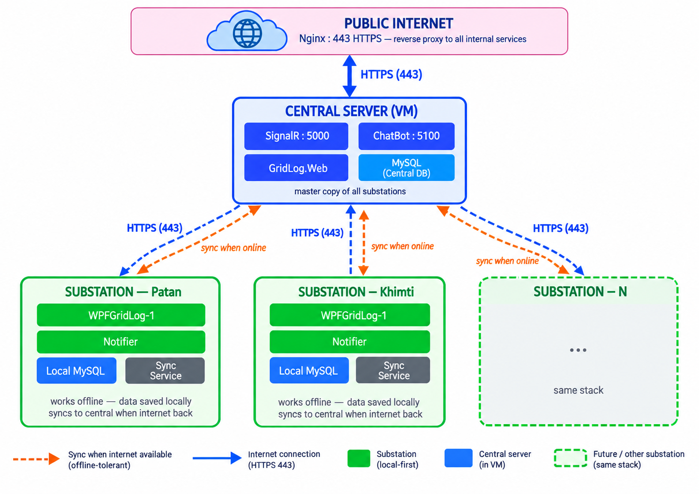
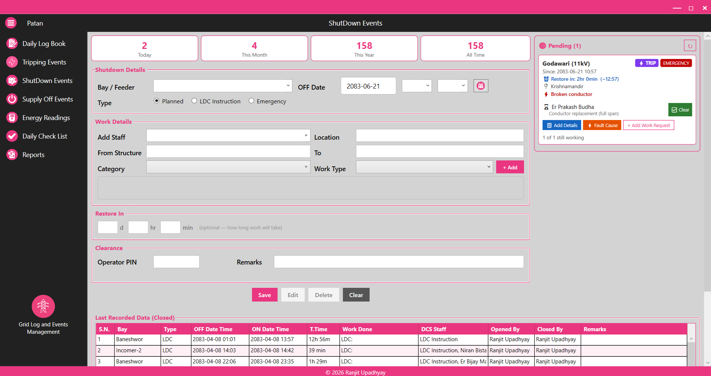
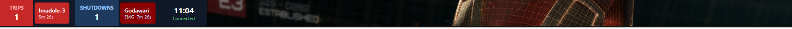
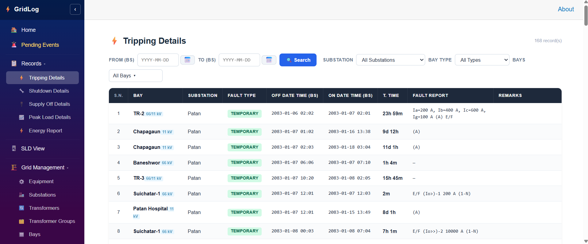
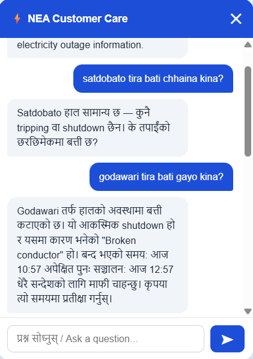

# GridLog — IT Review Package

**Nepal Electricity Authority (NEA) — Power Grid Event Management System**

This repository is provided for IT review purposes only. It contains documentation, architecture overview, sample source code, and anonymised data. The full production source code is not included.

---

## What is GridLog?

GridLog is a real-time power grid monitoring and event management system built for NEA substations. It captures relay tripping events and planned shutdown events, notifies control room operators instantly, and provides a public customer care chatbot for outage queries in Nepali and English.

---

## System Components

| Component | Type | Purpose |
|---|---|---|
| **WPFGridLog-1** | WPF Desktop | Substation operator app — event entry, tripping/shutdown log |
| **GridLog.Notifier** | WPF Desktop | Windows AppBar — live trip/shutdown chips with elapsed timer and bell alert |
| **WPFGridLog-1.SignalR** | ASP.NET Core | SignalR hub + REST API server — real-time push to all clients |
| **GridLog.ChatBot** | ASP.NET Core | Public NEA chatbot using OpenAI — bilingual (Nepali/English) |
| **GridLog.Web** | Blazor WASM | Central web dashboard — cross-substation event viewer |

---

## Quick Links

- [Architecture Overview](docs/Architecture.md)
- [Database Schema](docs/Database.md)
- [REST API Reference](docs/API.md)
- [Security Notes](docs/Security.md)
- [Deployment Guide](docs/Deployment.md)

---

## Technology Stack

- **Backend:** ASP.NET Core 10, SignalR, MySql.Data
- **Frontend (Desktop):** WPF (.NET 10, Windows)
- **Frontend (Web):** Blazor WebAssembly (.NET 10)
- **Database:** MySQL 8.0
- **AI:** OpenAI GPT-4o-mini
- **Hosting:** Windows Server 2022, IIS, Windows Services

---

## Screenshots

### System Architecture

### Substation Desktop App — Tripping Events

### Live Notifier Bar

### Web Dashboard

### Public Chatbot

---

## License

This package is shared for review only. See [LICENSE-REVIEW.txt](LICENSE-REVIEW.txt).
